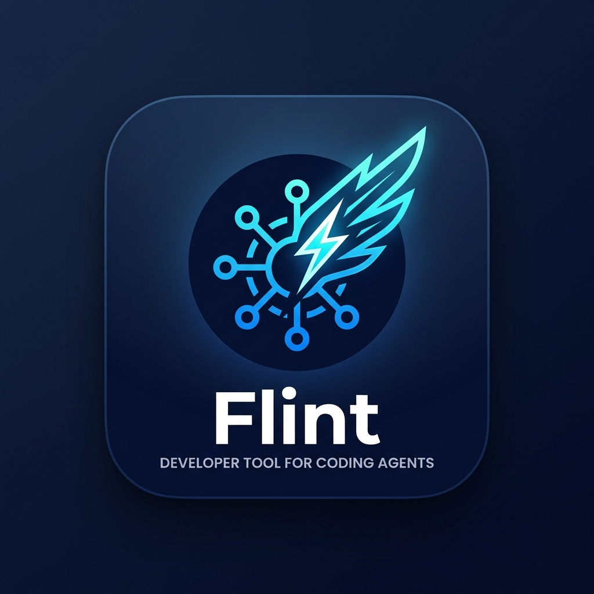
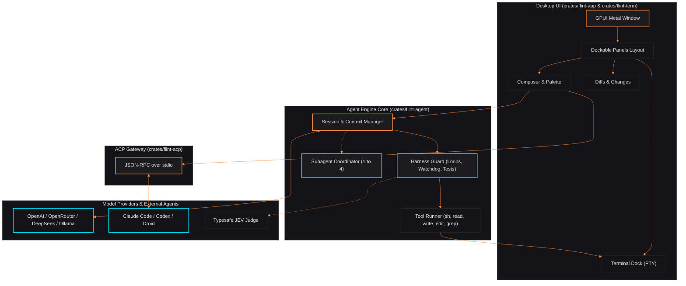
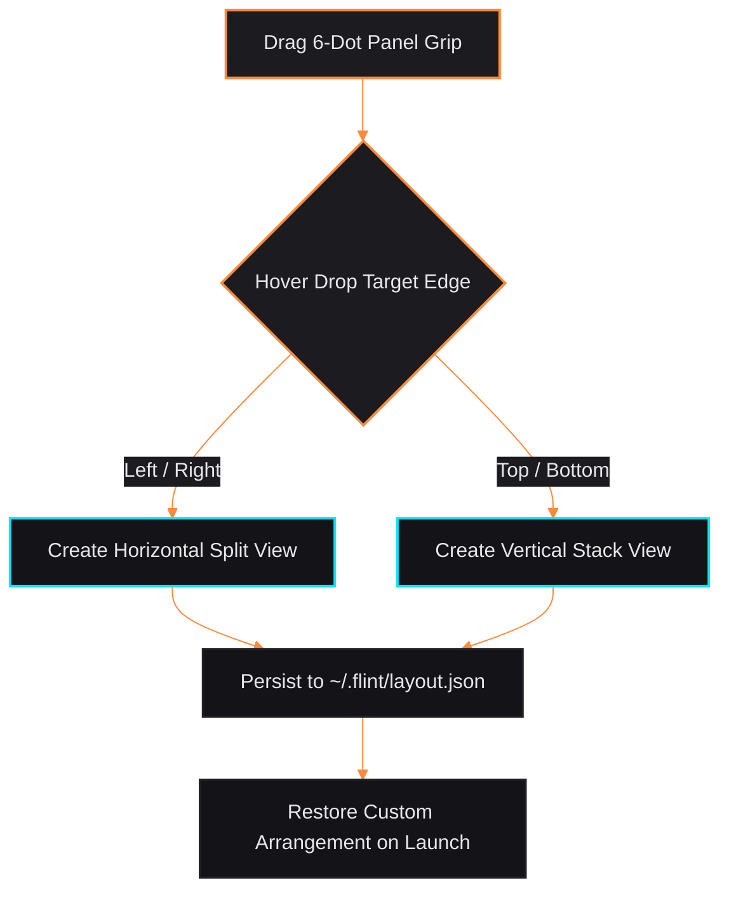
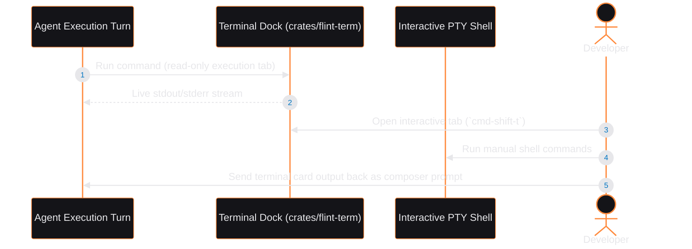
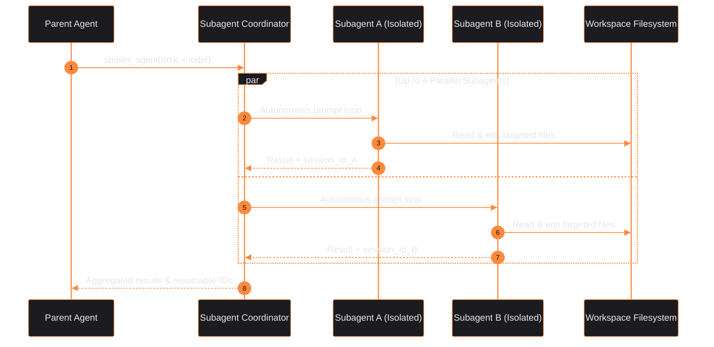
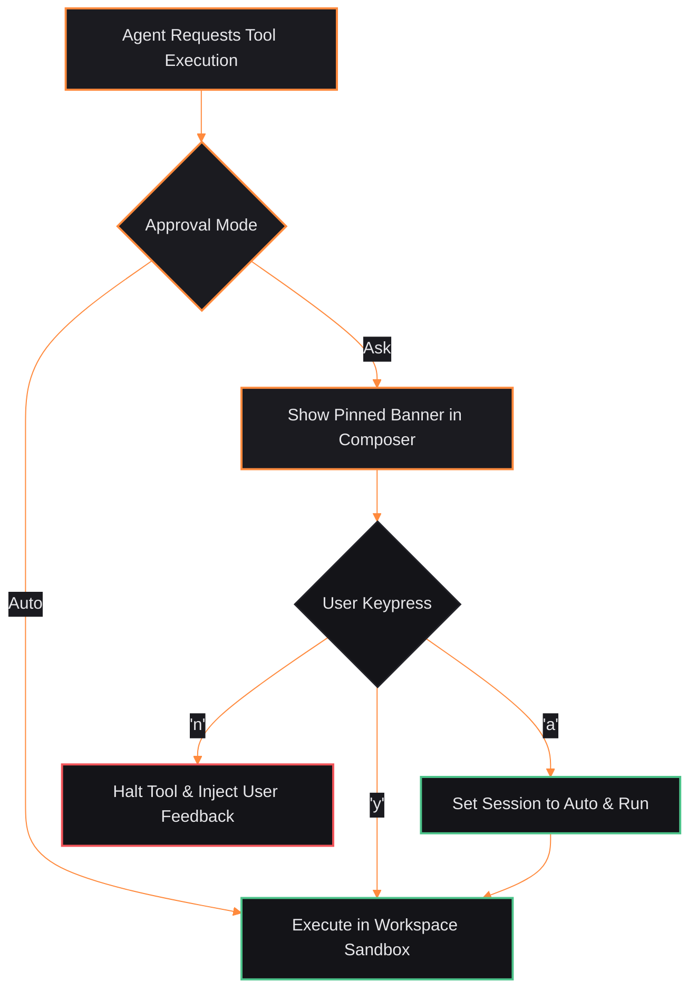
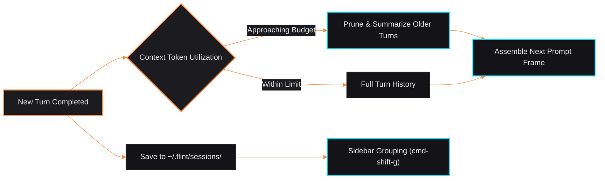
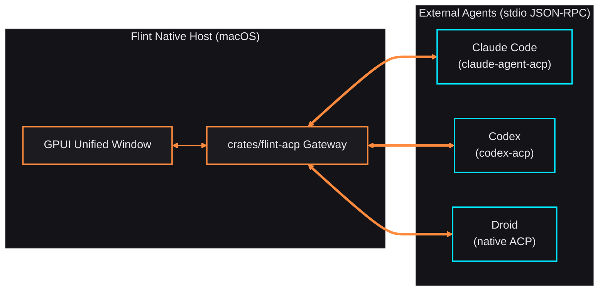

<p align="center">
  
</p>

<p align="center">
  
</p>

<h1 align="center">Flint</h1>

<p align="center">
  <strong>A native macOS desktop app for coding agents, written in Rust with <a href="https://github.com/zed-industries/zed">GPUI</a>.</strong><br />
  Run Flint's own agent against any OpenAI-compatible model, or drive Claude Code, Codex, and Droid from the same window.
</p>

<p align="center">
  <a href="#features">Features</a> •
  <a href="#architecture">Architecture</a> •
  <a href="#workspace--interface">Workspace</a> •
  <a href="#requirements">Requirements</a> •
  <a href="#build-and-run">Quick Start</a> •
  <a href="#configure-a-provider">Configuration</a> •
  <a href="#claude-code-codex-and-droid">ACP Agents</a> •
  <a href="#keyboard-shortcuts">Shortcuts</a> •
  <a href="#contributing">Contributing</a>
</p>

<p align="center">
  
  
  
  
</p>

---

<p align="center">
  
</p>

> [!NOTE]
> **Status: Early Preview.** macOS first. Linux and Windows are untested. Expect rough edges and breaking changes.

## Features

- **Its own agent.** A Chat Completions agent loop with tools: shell, read,
  write, edit and grep. It works with any OpenAI-compatible endpoint.
- **Subagents.** Flint's native agent can delegate independent tasks to isolated,
  resumable child sessions, with up to four running in parallel. Choose a
  different default model in Settings, or let the agent select a model per task.
  Expand a delegation card to inspect the child's activity.
- **Harness guard rules** that help cheaper models finish the job: loop
  detection, test-before-done checks, a watchdog for turns that edit nothing,
  and tool-call repair. An optional [JEV judge](#optional-jev-judge) can confirm
  the guard's suspicions.
- **Claude Code, Codex and Droid** as alternative agents over the
  [Agent Client Protocol](https://agentclientprotocol.com), using your own
  subscriptions.
- **Sessions.** Several run concurrently, are saved to `~/.flint/sessions/`, and
  are restored on launch. Long conversations are trimmed to a context budget.
  Drafts stay with their session. **Jump to latest** resumes following output
  after you scroll back.
- **Git worktrees.** Choose **Git worktrees…** from the composer's `+` menu
  or command palette to open an existing checkout or create one on a new
  branch. Enter a base branch or commit (default `HEAD`). New checkouts live
  under `~/.flint/worktrees/` (or `$FLINT_HOME/worktrees/`) and inherit the
  selected agent without moving the original session or its draft.
  Sessions, terminals, file mentions and edits use the selected checkout;
  worktrees still group under the same repository in the sidebar.
  Removal requires confirmation, refuses dirty or locked checkouts, and is
  disabled for checkouts referenced by sessions, archives or terminals.
  It never force-deletes a checkout or deletes its branch.
- **Prompt queue and steering.** Keep writing while the agent works.
  **Enter** or **Queue** adds a follow-up to the session's **Up next** tray;
  prompts run one at a time after successful turns. Edit, reorder, remove,
  pause or resume them without changing your current draft. Files and images
  are captured when queued, and pending prompts restore **paused** after restart.
  The queue holds up to 20 prompts and 32 MB of captured content.
  **Steer now** applies a queued instruction at the native agent's next model
  step without interrupting tools. With Claude, Codex or Droid, it stops the
  current turn and sends that prompt next instead. The composer's **Steer**
  button (or **⌘Enter**, when no approval is pending) applies a draft directly.
  **Stop** pauses pending work rather than starting another queued turn.
  Output sent from a tool card or terminal joins the same queue when busy.
- **Approvals.** Auto-run, or ask before changes; approvals are pinned above
  the composer (`y` approve, `a` approve always, `n` deny when the composer is
  empty).
- **Diffs.** A files-changed card per turn and a changes panel to review them.
- **File previews.** Click a local file link in an answer, or the eye button
  in Changes, to view it in the right-hand panel. Markdown is rendered;
  source and other UTF-8 text stay selectable and literal. Preview reads are
  limited to 512 KB; unavailable or unsupported files show an in-app message.
  Web links still open in your browser.
- **Dockable panels.** Drag the six-dot grip in the sidebar, chat, changes,
  or terminal header onto another panel's left, right, top, or bottom edge.
  Drag dividers to resize. The layout is saved to `~/.flint/layout.json`;
  **Reset panel layout** in the command palette restores the default.
- **Session panes.** Drag an actual session row from the sidebar onto the
  left, right, top, or bottom edge of the conversation or another session pane.
  Watch up to eight sessions side by side, resize their dividers, or use the
  grid button to arrange balanced rows. Each pane has **Chat**, **Terminal**,
  and **Both** controls, its own terminal tabs, and an independent draft.
  Fresh panes follow live agent commands; choosing a shell tab keeps that
  shell selected while the agent works.
  A sidebar click focuses a visible session or replaces the focused pane.
  Closing a pane keeps its session and terminals running; the expand button
  returns to one session. The layout and pane modes are saved in
  `~/.flint/session-layout.json`. After restarting, use **Open terminal** for
  a fresh shell; terminal processes and unsent drafts do not survive restart.
- **A terminal dock.** A real terminal (your shell, in the session's workspace)
  in tabs, docked at the bottom by default, with colours, scrollback,
  selection and links. Commands the agents run show up there too as read-only
  tabs; any command card can send its terminal to the agent, or its output
  back as a message.
- **`@` mentions** of workspace files, **`/` commands**
  (`/new`, `/clear`, `/model`, `/agent`, `/effort`, `/approval`, `/review`,
  `/help`) and a **command palette**.
  File indexing runs in the background. Text attachments use a bounded prefix
  of regular workspace files; changing a fresh session's project clears its
  relative file selections.
- **Image prompts.** Use **+ → Attach image…** to send up to four PNG, JPEG,
  GIF or WebP images (5 MB each), including files outside the workspace.
  Image prompts require a vision-capable model or ACP agent.

> [!TIP]
> **Limitations:** There is no light theme yet, and the thumbs up/down feedback on answers is only stored locally on your machine.

Native file tools refuse inputs above 8 MiB. Command approval is not a shell
sandbox: remembered command-prefix approvals apply only to allowlisted bare
`cargo` subcommands (`test`, `build`, `check`, `clippy`, `fmt`, `bench`);
other commands require an exact match.
Provider streams need a supported terminal completion before tools execute.
See [current gap-closure evidence and remaining limits](docs/GAP-CLOSURE-20261003.md).

## Architecture

Flint couples high-frame-rate native macOS rendering (Metal via GPUI) with an asynchronous agent engine capable of orchestrating native LLM tool execution and external CLI coding agents through the [Agent Client Protocol (ACP)](https://agentclientprotocol.com).

<p align="center">
  
</p>

<details>
  <summary><b>View Mermaid specification</b></summary>


</details>

> [!NOTE]
> For in-depth component specifications, sequence diagrams, and lifecycle flows, see [Architecture & Internals](docs/ARCHITECTURE.md).

### Turn Execution Lifecycle

Every turn passes through context budgeting, streaming model evaluation, tool execution via Harness Guard, and UI state reconciliation.

<p align="center">
  
</p>

## Workspace & Interface

Flint is designed around a responsive, low-latency macOS native interface powered by GPUI, combining modular dockable panels, a real PTY terminal dock, and an interactive changes reviewer.

### Dockable Panels & Dynamic Layout

Drag the six-dot grip on any panel header (Sidebar, Chat, Changes, or Terminal) onto another panel's top, bottom, left, or right edge to dock them side-by-side or stacked. Dividers can be dragged freely to resize panels.

<p align="center">
  
</p>

<details>
  <summary><b>View Mermaid docking layout flow</b></summary>


</details>

### Integrated Terminal Dock

The terminal dock embeds a full PTY shell session directly within your project workspace, complete with ANSI colours, full scrollback, and clickable links.

<p align="center">
  
</p>

<details>
  <summary><b>View Mermaid terminal dock flow</b></summary>


</details>

### Diffs & Changes Inspector

Review code changes turn-by-turn with syntax-highlighted unified and side-by-side diff viewers before applying changes or committing work.

<p align="center">
  
</p>

<details>
  <summary><b>View Mermaid diff review flow</b></summary>


</details>

```mermaid
%%{init: {
  'theme': 'base',
  'themeVariables': {
    'darkMode': true,
    'primaryColor': '#1b1b20',
    'primaryTextColor': '#e7e7ea',
    'primaryBorderColor': '#ff8a3d',
    'lineColor': '#ff8a3d',
    'secondaryColor': '#141418',
    'tertiaryColor': '#0e0e10',
    'mainBkg': '#141418',
    'nodeBorder': '#ff8a3d',
    'clusterBkg': '#141418',
    'clusterBorder': '#222228',
    'defaultLinkColor': '#ff8a3d',
    'titleColor': '#e7e7ea',
    'edgeLabelBackground': '#1b1b20'
  }
}}%%
flowchart LR
    classDef default fill:#141418,stroke:#222228,stroke-width:1.5px,color:#e7e7ea;
    classDef ember fill:#1b1b20,stroke:#ff8a3d,stroke-width:2px,color:#e7e7ea;
    classDef green fill:#141418,stroke:#4cc38a,stroke-width:2px,color:#e7e7ea;
    classDef cyan fill:#141418,stroke:#00e5ff,stroke-width:2px,color:#e7e7ea;

    Edit["Agent Tool: Edit / Write"] --> Capture["Diff Snapshot Capture"]
    Capture --> Card["Turn Card: Files Changed (+ / -)"]
    Card --> Inspector["Changes Panel Inspector (cmd-j)"]
    Inspector --> Review{"Developer Review"}
    Review -->|Accept| Commit["Stage in Workspace Git"]
    Review -->|Revert / Deny| Undo["Revert File Changes"]

    class Edit,Capture,Review ember;
    class Card,Inspector cyan;
    class Commit green;
```

## Requirements

- Rust, pinned by [`rust-toolchain.toml`](rust-toolchain.toml); `rustup`
  installs it automatically.
- macOS with the Xcode command-line tools (`xcode-select --install`), which
  provide the Metal toolchain GPUI renders with.

## Build and run

```sh
cargo run --release -p flint-app            # opens flint in the current directory
cargo run --release -p flint-app -- ~/code/my-project
cargo run -p flint-app -- --demo            # scripted demo, no model needed
```

The binary is `flint`. The first release build takes several minutes.

## Configure a provider

flint talks to any OpenAI-compatible Chat Completions endpoint. With nothing
configured it uses `https://api.openai.com/v1` and `gpt-4.1-mini`; the model
and endpoint can be changed in Settings (`cmd-,`) or in the config file.

The API key is looked up in this order: an `api_key_file` or `api_key_env`
set in the config file or Settings, then the `FLINT_API_KEY` environment
variable, then `OPENAI_API_KEY`. The key is never shown or logged.
`FLINT_BASE_URL` and `FLINT_MODEL` override the endpoint and model for one run.

Settings live in `~/.flint/config.toml` (or `$FLINT_HOME/config.toml`):

```toml
model = "gpt-4.1-mini"
subagent_model = ""                   # empty inherits the parent model
base_url = "https://api.openai.com/v1"
api_key_env = "OPENAI_API_KEY"        # or: api_key_file = "~/.config/flint/key"
approval = "auto"                     # or "ask"
effort = "medium"                     # low, medium, high, or "" for the default
```

Other providers, changing only those lines:

| Provider | `base_url` | `model` (example) | Key |
| --- | --- | --- | --- |
| OpenAI | `https://api.openai.com/v1` | `gpt-4.1-mini` | `OPENAI_API_KEY` |
| DeepSeek | `https://api.deepseek.com/v1` | `deepseek-chat` | `api_key_env = "DEEPSEEK_API_KEY"` |
| OpenRouter | `https://openrouter.ai/api/v1` | `anthropic/claude-sonnet-4.5` | `api_key_env = "OPENROUTER_API_KEY"` |
| Ollama | `http://localhost:11434/v1` | `qwen2.5-coder` | any non-empty value, e.g. `FLINT_API_KEY=ollama` |
| Local server (llama.cpp, vLLM, LM Studio) | `http://localhost:8080/v1` | the name your server reports | any non-empty value |

Model names change often; check your provider's list.

### Subagents

<p align="center">
  
</p>

The native agent's `spawn_agent` tool follows Zed's delegation design: each child
has its own conversation, shares the workspace and approval mode, and returns
only its final answer plus a `session_id`. The parent can use that id for
follow-ups, including after a saved session is reopened. Children cannot spawn
more children. Interrupting a turn stops its children too.

<details>
  <summary><b>View Mermaid sequence flow</b></summary>


</details>

Set **Subagent model** in Settings (`cmd-,`) or `subagent_model` in the config
file. `FLINT_SUBAGENT_MODEL` overrides it for one run. These settings apply when
a new Flint engine session starts. Model selection for new children is:
explicit `spawn_agent.model`, then the configured subagent model, then the parent
model. Resumed children keep their original model and reasoning effort.

All models use the configured endpoint and API key. For models from different
vendors, use a multi-model gateway such as OpenRouter. The agent can call
`list_models` to discover exact ids; an unavailable explicit model returns an
error rather than silently falling back.

Consecutive independent `spawn_agent` calls in one model response run in
parallel (up to four at a time). Children edit the same workspace, not separate git worktrees,
so delegated edits must target different files. A parent retains up to 32 child
sessions; further tasks can resume an existing child. Claude Code, Codex and Droid
still use their own delegation implementations, not Flint's tool.

### Approvals & Permission Security Gate

Flint provides two execution modes configured via `approval`:
- **`auto` (Auto-Run):** The agent executes tools autonomously without interrupting you.
- **`ask` (Ask-Before-Changes):** Actions that modify files or run shell commands are paused for review.

When `ask` mode is active, approvals are pinned directly above the composer with dedicated single-key shortcuts:
- <kbd>Y</kbd>: Approve the current action.
- <kbd>A</kbd>: Approve always for the current session.
- <kbd>N</kbd>: Deny the action and return to the composer to redirect the agent.

<p align="center">
  
</p>

<details>
  <summary><b>View Mermaid approvals gate flow</b></summary>


</details>

### Sessions & Context Token Budgeting

Flint retains conversation history and automatically protects model context limits:
- **Local Persistence:** All conversations are durably saved to `~/.flint/sessions/<session_id>.json` and restored on app launch.
- **Context Budgeting:** When conversation length approaches the model's context ceiling, Flint preserves the system instructions and recent turns while compacting earlier history into concise summaries.
- **Dynamic Grouping:** Organize your active sessions by **Project**, **Status**, or **Agent Type** via the session sidebar with <kbd>⌘</kbd> <kbd>⇧</kbd> <kbd>G</kbd>.

<p align="center">
  
</p>

<details>
  <summary><b>View Mermaid session context flow</b></summary>


</details>

## Claude Code, Codex and Droid

<p align="center">
  
</p>

<details>
  <summary><b>View Mermaid protocol flow</b></summary>


</details>

For Claude Code and Codex, install the ACP adapters, then sign in once with
each CLI so the adapter can reuse your login:

```sh
npm i -g @agentclientprotocol/claude-agent-acp
npm i -g @agentclientprotocol/codex-acp
claude    # log in once
codex     # log in once
```

Pick the agent for a session from the agent picker, with `/agent claude`,
`/agent codex`, `/agent droid` or `/agent flint`, or from the command palette.
These agents run their own loops, so flint's harness guard rules do not apply
to them. They use your own agent accounts, not an API key from flint.

Droid speaks ACP natively, so it needs no adapter. Install Droid and sign in
once in a terminal:

```sh
npm i -g droid                      # or: brew install --cask droid
droid                              # log in to Factory
```

Choose **Droid** in the agent picker, type `/agent droid`, or use **New Droid
session** in the command palette. Flint launches `droid exec --output-format acp`
and uses Droid's own model and mode options when it reports them. Droid runs
its own tools, settings, and subagents; Flint's native `subagent_model` setting
does not change Droid's subagent models.

Claude Code prefers `ANTHROPIC_API_KEY` over a subscription login whenever it
is set, so flint removes `ANTHROPIC_API_KEY` and `ANTHROPIC_AUTH_TOKEN` from the
adapter's environment and Claude Code uses your plan. To bill an API key
instead, launch flint with `FLINT_CLAUDE_USE_API_KEY=1`.

The first message in a new Claude Code or Codex session can take 20–50 seconds
while the adapter starts.

## Keyboard shortcuts

| Shortcut | Action |
| --- | --- |
| <kbd>⌘</kbd> <kbd>N</kbd> | New session |
| <kbd>⌘</kbd> <kbd>O</kbd> | Open a folder |
| <kbd>⌘</kbd> <kbd>K</kbd> or <kbd>⌘</kbd> <kbd>⇧</kbd> <kbd>P</kbd> | Command palette |
| <kbd>⌘</kbd> <kbd>L</kbd> | Focus the composer |
| <kbd>⌘</kbd> <kbd>.</kbd> | Interrupt the running turn |
| <kbd>⇧</kbd> <kbd>Tab</kbd> | Toggle auto-run / ask before changes |
| <kbd>⌘</kbd> <kbd>⇧</kbd> <kbd>A</kbd> | Toggle approval mode |
| <kbd>⌘</kbd> <kbd>J</kbd> | Toggle the changes panel |
| <kbd>⌘</kbd> <kbd>B</kbd> | Toggle the sidebar |
| <kbd>⌘</kbd> <kbd>⇧</kbd> <kbd>G</kbd> | Group sessions by project, status or agent |
| <kbd>⌘</kbd> <kbd>⇧</kbd> <kbd>R</kbd> | Reveal the workspace in Finder |
| <kbd>Ctrl</kbd> <kbd>`</kbd> | Show or hide the terminal dock |
| <kbd>⌘</kbd> <kbd>⇧</kbd> <kbd>T</kbd> | Open a terminal in the workspace |
| <kbd>⌘</kbd> <kbd>,</kbd> | Settings |
| <kbd>⌘</kbd> <kbd>Q</kbd> | Quit |

In the `@` and `/` menus: up/down to move, enter or tab to accept, escape to
dismiss.

## Harness Guard & JEV Judge

Flint equips models with autonomous **harness guard rules** that prevent runaway execution and guarantee completion quality:
- **Loop Detection:** Detects repeated cyclical tool invocation patterns and breaks out before tokens are wasted.
- **Watchdog:** Monitors turns that execute without editing code or making forward progress.
- **Test-Before-Done:** Requires execution and verification of tests before concluding tasks that touched source files.
- **Tool-Call Repair:** Automatically repairs malformed JSON or invalid parameter signatures from cheaper models.

<p align="center">
  
</p>

<details>
  <summary><b>View Mermaid guard logic tree</b></summary>

```mermaid
%%{init: {
  'theme': 'base',
  'themeVariables': {
    'darkMode': true,
    'primaryColor': '#1b1b20',
    'primaryTextColor': '#e7e7ea',
    'primaryBorderColor': '#ff8a3d',
    'lineColor': '#ff8a3d',
    'secondaryColor': '#141418',
    'tertiaryColor': '#0e0e10',
    'mainBkg': '#141418',
    'nodeBorder': '#ff8a3d',
    'clusterBkg': '#141418',
    'clusterBorder': '#222228',
    'defaultLinkColor': '#ff8a3d',
    'titleColor': '#e7e7ea',
    'edgeLabelBackground': '#1b1b20'
  }
}}%%
flowchart TD
    classDef default fill:#141418,stroke:#222228,stroke-width:1.5px,color:#e7e7ea;
    classDef ember fill:#1b1b20,stroke:#ff8a3d,stroke-width:2px,color:#e7e7ea;
    classDef green fill:#141418,stroke:#4cc38a,stroke-width:2px,color:#e7e7ea;
    classDef red fill:#141418,stroke:#f2555a,stroke-width:2px,color:#e7e7ea;
    classDef cyan fill:#141418,stroke:#00e5ff,stroke-width:2px,color:#e7e7ea;

    In["Agent Action Proposal"] --> Guard{"Guard Rules Inspection"}
    Guard -->|Cyclic Loops| BreakLoop["Break Infinite Loop"]
    Guard -->|Malformed Syntax| Repair["Automatic Tool-Call Repair"]
    Guard -->|No Edits Made| Warn["Watchdog Guidance Nudge"]
    Guard -->|Clean Request| Execute["Execute Action via Sandbox"]

    BreakLoop --> JEV{"Optional JEV Judge?"}
    Warn --> JEV
    JEV -->|Yes| Consult["Typesafe JEV Confirmation"]
    Consult -->|Confirmed| Intervene["Intervene / Re-prompt Turn"]
    Consult -->|False Alarm| Execute
    JEV -->|No (Heuristic)| Intervene

    class In,Guard,JEV ember;
    class Execute green;
    class BreakLoop,Warn,Intervene red;
    class Repair,Consult cyan;
```
</details>

### Optional JEV judge

Set `TYPESAFE_API_KEY` to have the guard ask a Typesafe "JEV" judge to confirm
loop and verification suspicions instead of relying on heuristics alone.
`TYPESAFE_BASE_URL` and `JEV_MODEL` override its endpoint and model. Without
the key the harness uses its heuristics; flint works fine either way.

## Project layout

```
crates/flint-agent/   the agent engine: provider client, tools, harness, sessions
crates/flint-acp/     Claude Code, Codex and Droid over the Agent Client Protocol
crates/flint-app/     the GPUI app (binary: flint)
tools/blueprint/      evidence harness that drives the real app (Python + Swift)
```

The blueprint harness (`sweep.py`, `interact.py`, `live.py`, `perf.py`)
launches the app, takes screenshots and measures memory, CPU and start-up; see
[`tools/blueprint/README.md`](tools/blueprint/README.md). Its output goes to the
git-ignored `blueprint-out/`.

## Contributing

Issues and pull requests are welcome. Before sending a change:

```sh
cargo fmt --all
cargo clippy --workspace --all-targets -- -D warnings
cargo test --workspace
```

Tests never need a key or network access. The live tests in
`crates/flint-agent/tests/live.rs` are opt-in: set `FLINT_LIVE=1`,
`FLINT_API_KEY`, and optionally `FLINT_LIVE_BASE_URL` / `FLINT_LIVE_MODEL`.

## License

Apache-2.0; see [LICENSE](LICENSE) and [NOTICE](NOTICE).
