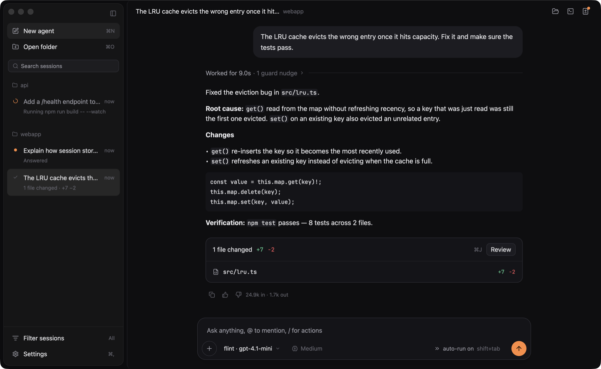

# flint

A native macOS desktop app for coding agents, written in Rust with
[GPUI](https://github.com/zed-industries/zed). Run flint's own agent against any
OpenAI-compatible model, or drive Claude Code and Codex from the same window.



> **Status: early preview.** macOS first. Linux and Windows are untested.
> Expect rough edges and breaking changes.

## Features

- **Its own agent.** A Chat Completions agent loop with tools: shell, read,
  write, edit and grep. It works with any OpenAI-compatible endpoint.
- **Harness guard rules** that help cheaper models finish the job: loop
  detection, test-before-done checks, a watchdog for turns that edit nothing,
  and tool-call repair. An optional [JEV judge](#optional-jev-judge) can confirm
  the guard's suspicions.
- **Claude Code and Codex** as alternative agents over the
  [Agent Client Protocol](https://agentclientprotocol.com), using your own
  subscriptions.
- **Sessions.** Several run concurrently, are saved to `~/.flint/sessions/`, and
  are restored on launch. Long conversations are trimmed to a context budget.
- **Approvals.** Auto-run, or ask before changes; approvals are pinned above
  the composer (`y` approve, `a` approve always, `n` deny when the composer is
  empty).
- **Diffs.** A files-changed card per turn and a changes panel to review them.
- **A terminal dock.** A real terminal (your shell, in the session's workspace)
  in tabs at the bottom of the window, with colours, scrollback, selection and
  links. Commands the agents run show up there too as read-only tabs; any
  command card can send its terminal to the agent, or its output back as a
  message.
- **`@` mentions** of workspace files, **`/` commands**
  (`/new`, `/clear`, `/model`, `/agent`, `/effort`, `/approval`, `/review`,
  `/help`) and a **command palette**.

Not done yet: there is no light theme, and the thumbs up/down on answers are
only stored on your machine.

## Requirements

- Rust, pinned by [`rust-toolchain.toml`](rust-toolchain.toml); `rustup`
  installs it automatically.
- macOS with the Xcode command-line tools (`xcode-select --install`), which
  provide the Metal toolchain GPUI renders with.

## Build and run

```sh
cargo run --release -p flint-app            # opens flint in the current directory
cargo run --release -p flint-app -- ~/code/my-project
cargo run -p flint-app -- --demo            # scripted demo, no model needed
```

The binary is `flint`. The first release build takes several minutes.

## Configure a provider

flint talks to any OpenAI-compatible Chat Completions endpoint. With nothing
configured it uses `https://api.openai.com/v1` and `gpt-4.1-mini`; the model
and endpoint can be changed in Settings (`cmd-,`) or in the config file.

The API key is looked up in this order: an `api_key_file` or `api_key_env`
set in the config file or Settings, then the `FLINT_API_KEY` environment
variable, then `OPENAI_API_KEY`. The key is never shown or logged.
`FLINT_BASE_URL` and `FLINT_MODEL` override the endpoint and model for one run.

Settings live in `~/.flint/config.toml` (or `$FLINT_HOME/config.toml`):

```toml
model = "gpt-4.1-mini"
base_url = "https://api.openai.com/v1"
api_key_env = "OPENAI_API_KEY"        # or: api_key_file = "~/.config/flint/key"
approval = "auto"                     # or "ask"
effort = "medium"                     # low, medium, high, or "" for the default
```

Other providers, changing only those lines:

| Provider | `base_url` | `model` (example) | Key |
| --- | --- | --- | --- |
| OpenAI | `https://api.openai.com/v1` | `gpt-4.1-mini` | `OPENAI_API_KEY` |
| DeepSeek | `https://api.deepseek.com/v1` | `deepseek-chat` | `api_key_env = "DEEPSEEK_API_KEY"` |
| OpenRouter | `https://openrouter.ai/api/v1` | `anthropic/claude-sonnet-4.5` | `api_key_env = "OPENROUTER_API_KEY"` |
| Ollama | `http://localhost:11434/v1` | `qwen2.5-coder` | any non-empty value, e.g. `FLINT_API_KEY=ollama` |
| Local server (llama.cpp, vLLM, LM Studio) | `http://localhost:8080/v1` | the name your server reports | any non-empty value |

Model names change often; check your provider's list.

## Claude Code and Codex

Install the ACP adapters, then sign in once with each CLI so the adapter can
reuse your login:

```sh
npm i -g @agentclientprotocol/claude-agent-acp
npm i -g @agentclientprotocol/codex-acp
claude    # log in once
codex     # log in once
```

Pick the agent for a session from the agent picker, with `/agent claude`,
`/agent codex` or `/agent flint`, or from the command palette. These agents run
their own loops, so flint's harness guard rules do not apply to them. They use
your own Claude and ChatGPT subscriptions, not an API key from flint.

Claude Code prefers `ANTHROPIC_API_KEY` over a subscription login whenever it
is set, so flint removes `ANTHROPIC_API_KEY` and `ANTHROPIC_AUTH_TOKEN` from the
adapter's environment and Claude Code uses your plan. To bill an API key
instead, launch flint with `FLINT_CLAUDE_USE_API_KEY=1`.

The first message in a new Claude Code or Codex session can take 20–50 seconds
while the adapter starts.

## Keyboard shortcuts

| Shortcut | Action |
| --- | --- |
| `cmd-n` | New session |
| `cmd-o` | Open a folder |
| `cmd-k` or `cmd-shift-p` | Command palette |
| `cmd-l` | Focus the composer |
| `cmd-.` | Interrupt the running turn |
| `shift-tab` | Toggle auto-run / ask before changes |
| `cmd-shift-a` | Toggle approval mode |
| `cmd-j` | Toggle the changes panel |
| `cmd-b` | Toggle the sidebar |
| `cmd-shift-r` | Reveal the workspace in Finder |
| `` ctrl-` `` | Show or hide the terminal dock |
| `cmd-shift-t` | Open a terminal in the workspace |
| `cmd-,` | Settings |
| `cmd-q` | Quit |

In the `@` and `/` menus: up/down to move, enter or tab to accept, escape to
dismiss.

## Optional JEV judge

Set `TYPESAFE_API_KEY` to have the guard ask a Typesafe "JEV" judge to confirm
loop and verification suspicions instead of relying on heuristics alone.
`TYPESAFE_BASE_URL` and `JEV_MODEL` override its endpoint and model. Without
the key the harness uses its heuristics; flint works fine either way.

## Project layout

```
crates/flint-agent/   the agent engine: provider client, tools, harness, sessions
crates/flint-acp/     Claude Code and Codex over the Agent Client Protocol
crates/flint-app/     the GPUI app (binary: flint)
tools/blueprint/      evidence harness that drives the real app (Python + Swift)
```

The blueprint harness (`sweep.py`, `interact.py`, `live.py`, `perf.py`)
launches the app, takes screenshots and measures memory, CPU and start-up; see
[`tools/blueprint/README.md`](tools/blueprint/README.md). Its output goes to the
git-ignored `blueprint-out/`.

## Contributing

Issues and pull requests are welcome. Before sending a change:

```sh
cargo fmt --all
cargo clippy --workspace --all-targets -- -D warnings
cargo test --workspace
```

Tests never need a key or network access. The live tests in
`crates/flint-agent/tests/live.rs` are opt-in: set `FLINT_LIVE=1`,
`FLINT_API_KEY`, and optionally `FLINT_LIVE_BASE_URL` / `FLINT_LIVE_MODEL`.

## License

Apache-2.0; see [LICENSE](LICENSE) and [NOTICE](NOTICE).
