# Flint Architecture & Internals

Flint is a high-performance native macOS desktop application for coding agents, engineered in Rust using the [GPUI](https://github.com/zed-industries/zed) GPU-accelerated UI framework. It supports both a native, autonomous agent loop and external agents adhering to the [Agent Client Protocol (ACP)](https://agentclientprotocol.com).

---

## 1. System Overview

Flint divides responsibilities across four specialized crates:

| Crate | Responsibility |
| --- | --- |
| [`crates/flint-app`](../crates/flint-app) | GPUI desktop application, windowing, dockable panel layout, event dispatch, session tabs, and command palette. |
| [`crates/flint-agent`](../crates/flint-agent) | Autonomous agent engine: OpenAI-compatible wire client, tool execution, context budgeting, subagents, and Harness Guard rules. |
| [`crates/flint-acp`](../crates/flint-acp) | ACP client adapter managing child processes for Claude Code, Codex, and Droid over standard I/O JSON-RPC. |
| [`crates/flint-term`](../crates/flint-term) | Integrated pseudo-terminal (PTY) dock, ANSI terminal emulation, scrollback, command execution tabs, and I/O streaming. |

  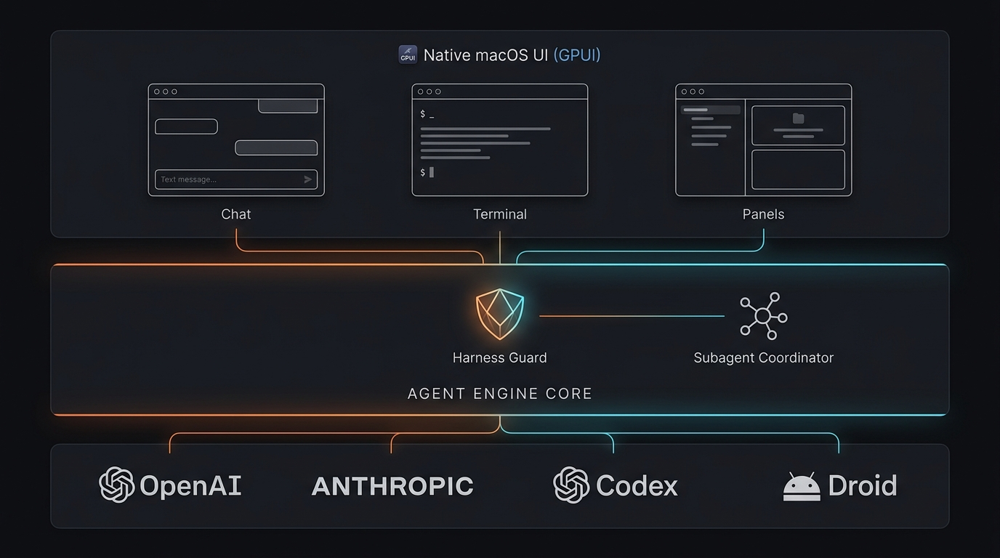

  
<b>View Mermaid architecture topology</b>

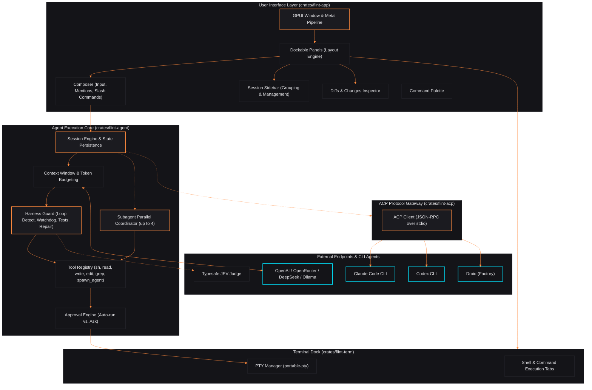

---

## 2. Turn Execution Lifecycle & Harness Guard

Every conversational turn in Flint's native engine passes through context window assembly, token budget trimming, model streaming, and the multi-stage **Harness Guard** pipeline.

  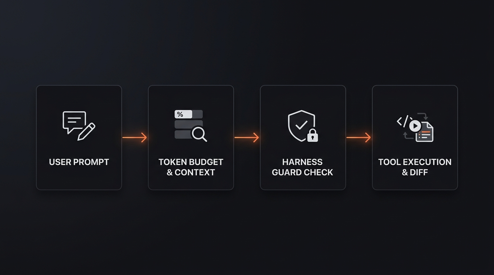

  
<b>View Mermaid sequence flow</b>

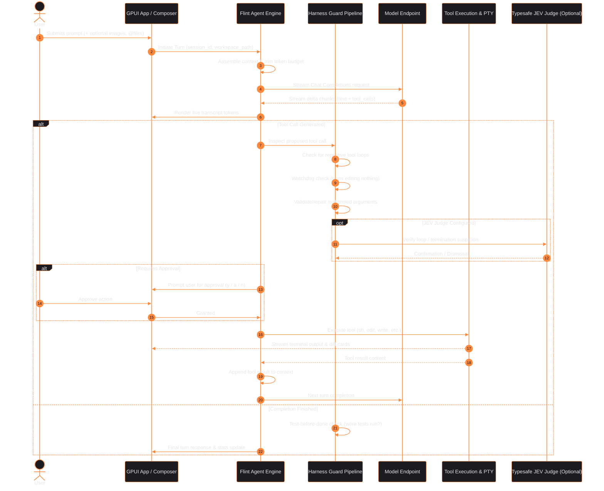

  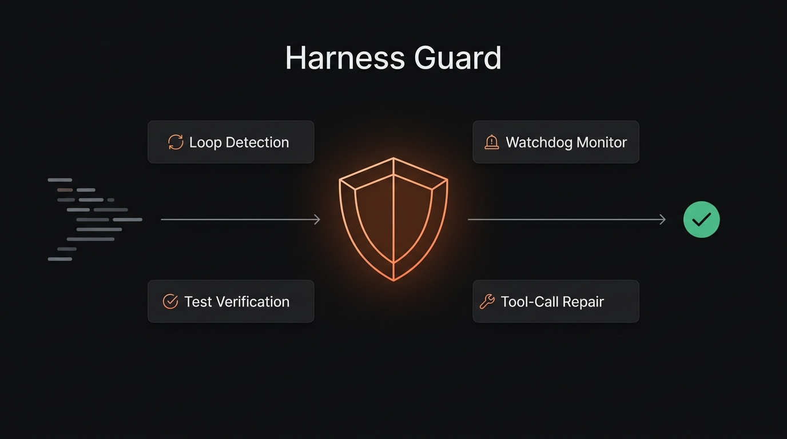

  
<b>View Mermaid guard logic tree</b>

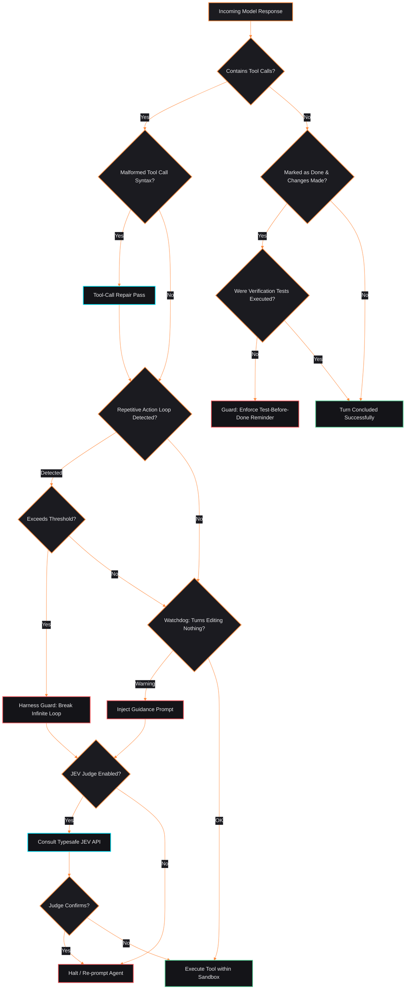

---

## 3. Subagent Parallel Delegation

Flint allows the native agent to spin off up to four independent, concurrent child sessions using the `spawn_agent` tool.

  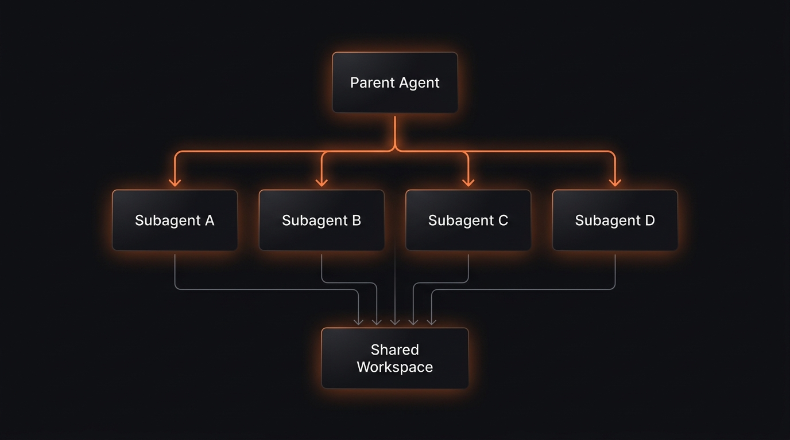

### Delegation Characteristics:
- **Isolated Contexts:** Each child has its own independent context window and token budget, preventing memory contamination.
- **Shared Workspace:** Children operate within the same workspace root; independent subagent operations can target different files concurrently.
- **Unified Approvals:** Children inherit the parent's approval policy (`auto` vs `ask`).
- **Resumability:** Each child run produces a durable `session_id`. The parent can invoke follow-ups on the same subagent session later.
- **Recursion Guard:** Child subagents are restricted from spawning grandchildren, preventing unbounded agent explosion.

  
<b>View Mermaid sequence flow</b>

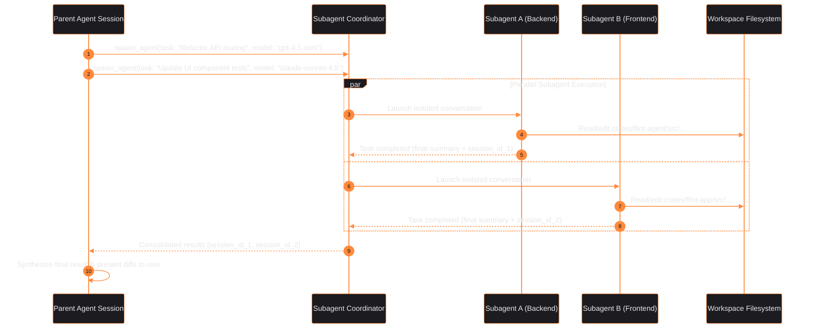

---

## 4. Agent Client Protocol (ACP) Integration

Flint acts as an ACP host, allowing Claude Code, Codex, and Droid to be launched and driven directly from the same native desktop UI without altering their native authentication or configuration workflows.

  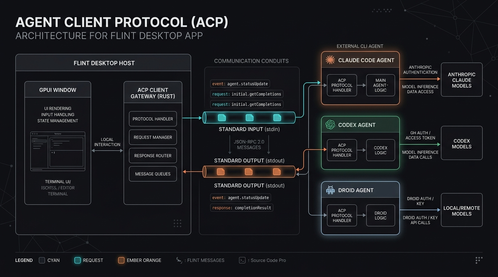

  
<b>View Mermaid protocol flow</b>

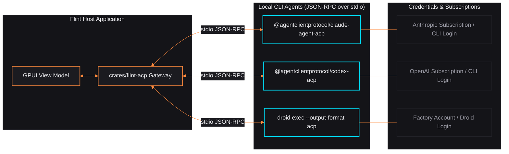

---

## 5. Dockable Panels & Flexible Workspace Engine

Flint's desktop window manager allows arbitrary arrangement of work areas via a flexible split-tree layout engine:
- **Modular Panels:** Sidebar (Session grouping), Chat (Conversation turns), Changes (Diff reviewer), and Terminal Dock.
- **Directional Snapping:** Dragging any panel's 6-dot grip provides visual drop targets for Top, Bottom, Left, or Right dock placement.
- **State Persistence:** Custom layouts serialize to `~/.flint/layout.json` upon divider adjustment and reload automatically on launch.

  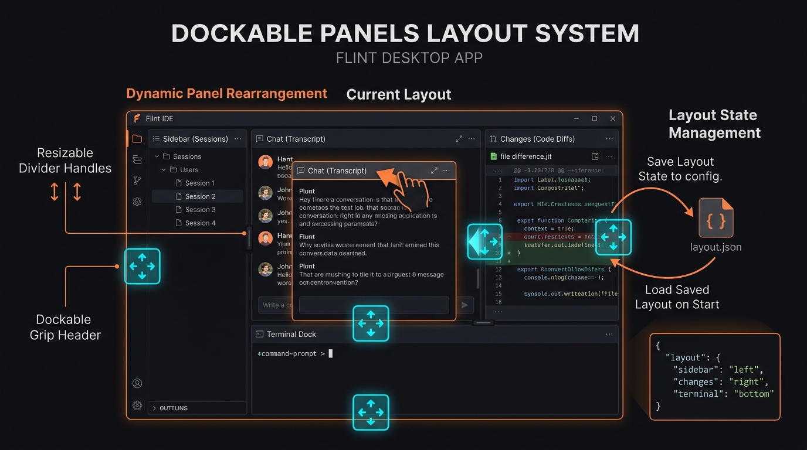

  
<b>View Mermaid layout state flow</b>

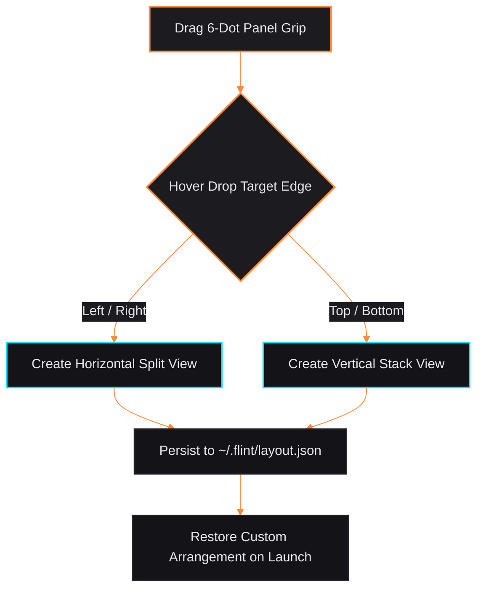

---

## 6. Integrated Terminal Dock & PTY Subsystem

The terminal subsystem (`crates/flint-term`) embeds interactive and headless PTY sessions within the project workspace:
- **Interactive Shells:** Native interactive shell sessions with full ANSI colour support, clickable hyperlinks, and scrollback.
- **Agent Command Mirroring:** Background commands executed by agents stream stdout/stderr live into read-only terminal tabs.
- **Bidirectional Feedback:** Any terminal tab's output buffer can be attached and routed directly back to the agent composer as conversational context.

  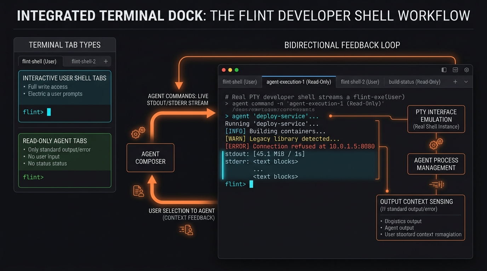

  
<b>View Mermaid terminal subsystem flow</b>

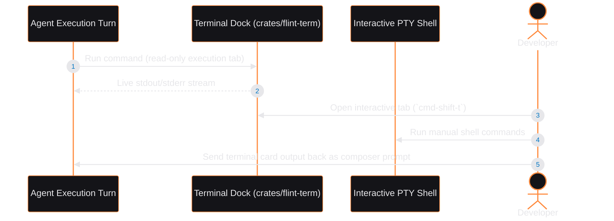

---

## 7. Approvals & Permission Security Gate

Flint implements a non-bypassable security gate for agent actions (`crates/flint-agent/src/approvals.rs`):
- **Autonomous vs Supervised:** Switch between `auto` (unattended execution) and `ask` (human review required).
- **Composer Integration:** Approval prompts pin directly above the composer with dedicated single-key accelerators (<kbd>Y</kbd>, <kbd>A</kbd>, <kbd>N</kbd>).
- **Execution Sandboxing:** Denied tool calls cleanly abort and return user guidance prompts without corrupting engine state.

  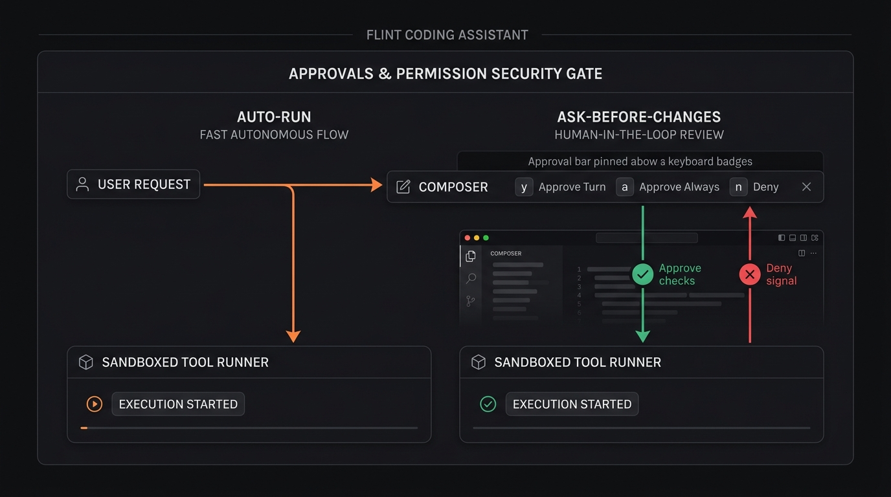

  
<b>View Mermaid security gate flow</b>

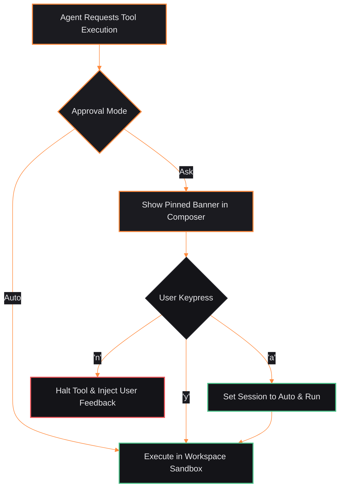

---

## 8. Diffs & Changes Inspection Pipeline

Turn-by-turn verification provides granular code inspection before changes hit git:
- **Turn Diff Cards:** Embedded cards in chat transcript displaying modified files with net additions (+) and deletions (-).
- **Changes Panel:** Full-window side-by-side or unified diff viewing toggled with <kbd>⌘</kbd> <kbd>J</kbd>.
- **Git State Mirroring:** Detects untracked vs modified workspace files in real time.

  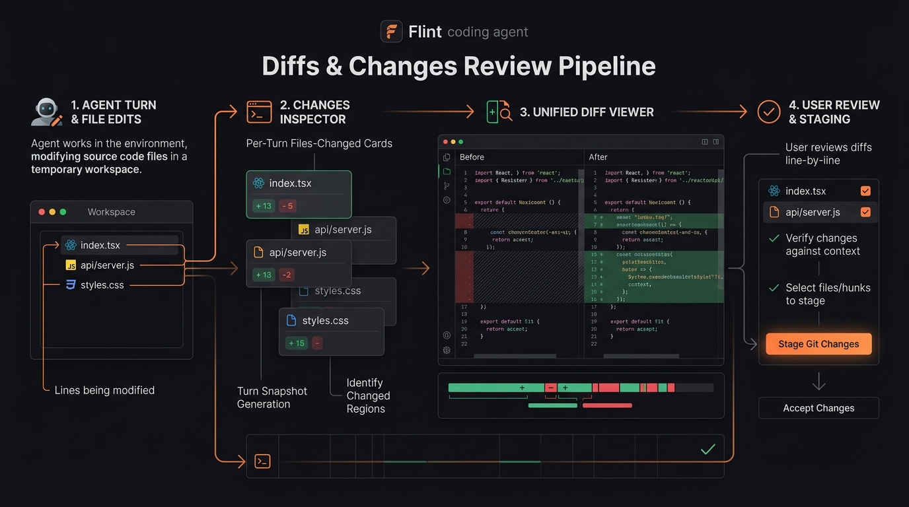

  
<b>View Mermaid changes pipeline flow</b>

```mermaid
%%{init: {
  'theme': 'base',
  'themeVariables': {
    'darkMode': true,
    'primaryColor': '#1b1b20',
    'primaryTextColor': '#e7e7ea',
    'primaryBorderColor': '#ff8a3d',
    'lineColor': '#ff8a3d',
    'secondaryColor': '#141418',
    'tertiaryColor': '#0e0e10',
    'mainBkg': '#141418',
    'nodeBorder': '#ff8a3d',
    'clusterBkg': '#141418',
    'clusterBorder': '#222228',
    'defaultLinkColor': '#ff8a3d',
    'titleColor': '#e7e7ea',
    'edgeLabelBackground': '#1b1b20'
  }
}}%%
flowchart LR
    classDef default fill:#141418,stroke:#222228,stroke-width:1.5px,color:#e7e7ea;
    classDef ember fill:#1b1b20,stroke:#ff8a3d,stroke-width:2px,color:#e7e7ea;
    classDef green fill:#141418,stroke:#4cc38a,stroke-width:2px,color:#e7e7ea;
    classDef cyan fill:#141418,stroke:#00e5ff,stroke-width:2px,color:#e7e7ea;

    Edit["Agent Tool: Edit / Write"] --> Capture["Diff Snapshot Capture"]
    Capture --> Card["Turn Card: Files Changed (+ / -)"]
    Card --> Inspector["Changes Panel Inspector (cmd-j)"]
    Inspector --> Review{"Developer Review"}
    Review -->|Accept| Commit["Stage in Workspace Git"]
    Review -->|Revert / Deny| Undo["Revert File Changes"]

    class Edit,Capture,Review ember;
    class Card,Inspector cyan;
    class Commit green;
```

---

## 9. Session Persistence & Context Window Budgeting

Flint balances long-running multi-turn memory against model context constraints:
- **Disk Persistence:** Every session is saved as an atomic JSON document in `~/.flint/sessions/<session_id>.json`.
- **Token Budgeting:** Dynamically reserves space for system prompt + tool schemas + response headroom.
- **Compacted Trimming:** Older turns are pruned into structured summaries when context limits are approached, preventing abrupt context window errors.
- **Sidebar Grouping:** Active sessions can be grouped by Project, Status, or Agent Type (<kbd>⌘</kbd> <kbd>⇧</kbd> <kbd>G</kbd>).

  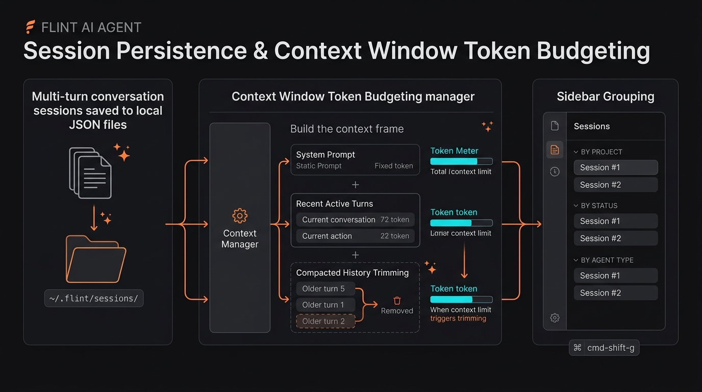

  
<b>View Mermaid session context flow</b>

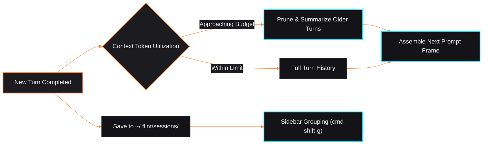

